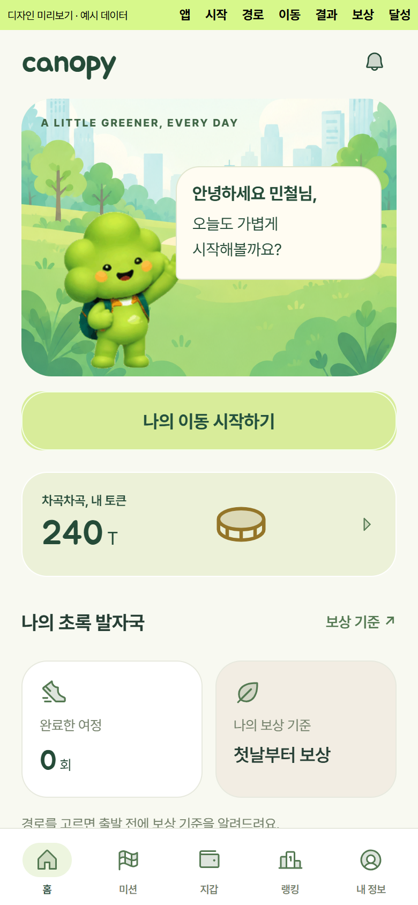
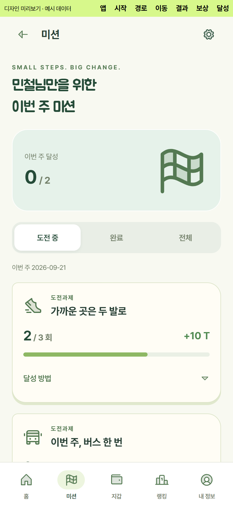
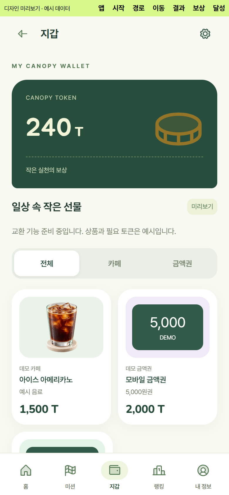
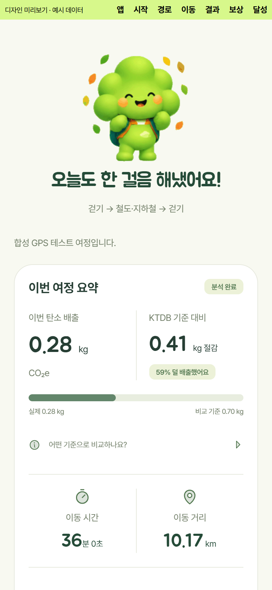
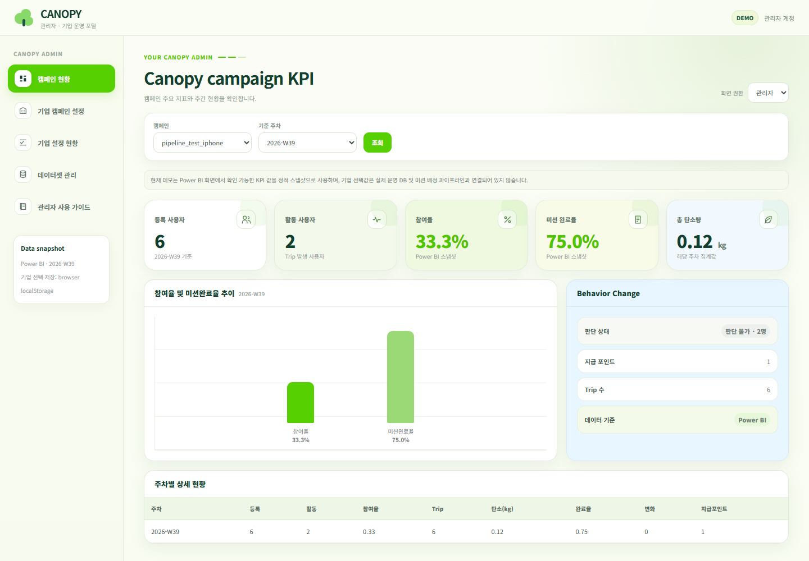
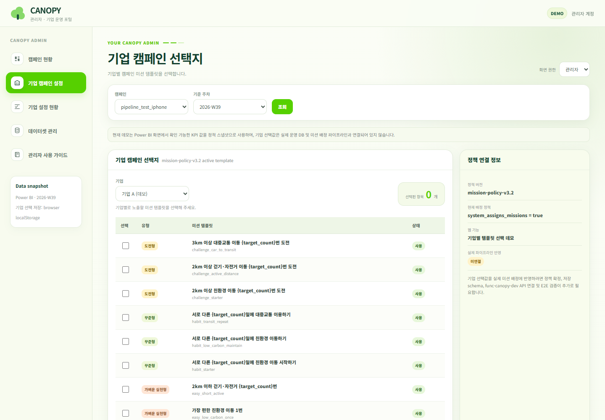

# Canopy Data Platform

<!-- CANOPY_PUBLIC_EDITION_START -->
> 팀의 허락을 받아 정리한 별도 공개 사본입니다. 원본은 비공개로 유지합니다.
> [공개 사본의 실행·검증 범위](docs/PUBLIC_EDITION.md) · [이용 조건](LICENSE) · [고지](NOTICE.md) · [데이터 출처](DATA_SOURCES.md) · [모델 고지](MODEL_NOTICES.md)
<!-- CANOPY_PUBLIC_EDITION_END -->


Canopy 프로젝트 통합 모노레포입니다. iPhone 애플리케이션, 백엔드/API, 머신러닝 모델, Azure 인프라, 데이터 자산, 공통 계약을 관리합니다.

현재 플랫폼은 iPhone GPS 수집부터 Azure Functions·Event Hubs·ADLS, Databricks 기반 GPS 처리와 주간 분석, Baseline·Behavior Change·Mission·Reward·Ranking·Campaign KPI, API/iOS 소비까지의 데이터 흐름을 통합합니다.

## 저장소 구조

```text
canopy-data-platform/
├── apps/                         # 배포 가능한 애플리케이션
│   ├── api/                      # 백엔드/API
│   └── ios/                      # iPhone 애플리케이션
│
├── ml/                           # 머신러닝 모델 및 파이프라인
│   ├── models/                   # 예측 과제별 모델
│   │   └── _template/            # 신규 모델 디렉터리 템플릿
│   ├── shared/                   # ML 전용 공통 코드
│   └── pipelines/                # 학습·평가·배포 파이프라인
│
├── cloud/
│   └── azure/                    # Azure 전용 인프라 및 배포 정의
│       ├── infrastructure/
│       ├── functions/
│       │   ├── func_canopy_dev/  # 공용 Azure Functions 배포 소스
│       │   └── gps_ingest/       # GPS 수집 Function
│       ├── pipelines/
│       │   ├── databricks/       # Databricks 배포/실행 구성
│       │   ├── gps_streaming/    # GPS 스트리밍 처리
│       │   └── weekly_analysis/  # 주간 분석 파이프라인
│       ├── monitoring/
│       └── config/
│
├── data/                         # 활성 프로젝트 데이터 작업 공간
│   ├── raw/                      # 직접 수집한 원천 데이터
│   ├── external/                 # 외부 제공 원천 데이터
│   ├── interim/                  # 전처리·가공 중간 산출물
│   ├── processed/                # 학습·평가·서빙용 가공 데이터
│   ├── reference/                # 기준/참조 데이터
│   └── fixtures/                 # 소규모 테스트 데이터
│
├── shared/                       # iOS·API·ML·cloud 간 공통 계약
│   ├── schemas/
│   ├── configs/
│   └── constants/
│
├── tools/                        # 개발 및 운영 보조 도구
│   ├── ios/
│   ├── ml/
│   ├── azure/
│   ├── data/
│   └── repo/
│
├── tests/                        # 컴포넌트 간 테스트
│   ├── integration/
│   └── e2e/
│
├── docs/                         # 프로젝트 문서
│   ├── architecture/
│   ├── ios/
│   ├── ml/
│   ├── azure/
│   ├── data/
│   └── decisions/
│
├── legacy/
│   └── original-data-platform/   # 기존 프로토타입 보존 영역
│
├── .github/                      # GitHub Actions 및 저장소 자동화
├── .gitignore
├── CONTRIBUTING.md
└── README.md
```

> 상위 디렉터리는 **소유권과 런타임 경계**를 나타냅니다. 구현 세부 디렉터리는 실제 기능이 추가될 때 필요한 범위에서만 생성합니다.

## 핵심 데이터 흐름

GPS 수집과 주행 처리 흐름은 다음과 같습니다.

```text
iPhone GPS
→ Azure Functions
→ Event Hubs
├→ Databricks GPS Streaming
└→ Event Hubs Capture / ADLS Raw
→ Trip Processing
→ Final Trip
```

주간 분석과 서비스 소비 흐름은 다음과 같습니다.

```text
Final Trip Gold
→ Weekly Gold
→ Baseline / Behavior Change
→ Mission Profile / Mission Response
→ Reward Calculation
→ Reward Ledger
→ Ranking / Campaign KPI
→ API / iOS
```

## Weekly Analysis Pipeline

주간 분석 파이프라인은 `cloud/azure/pipelines/weekly_analysis/`에서 관리합니다. `weekly_pipeline.py`를 중심으로 Final Trip 입력을 사용자·캠페인·주차 단위의 분석 결과로 변환합니다.

현재 `main`에 연결된 주요 단계는 다음과 같습니다.

```text
final_trip_gold_input
→ weekly_summary
→ weekly_gold
→ baseline_eligibility
→ personal_baseline
→ personal_ready_users
→ global_eligibility
→ global_baseline
→ baseline_gold
→ behavior_change
→ weekly_user_profile
→ reward_calculation
→ ranking
→ campaign_kpi
```

- `weekly_user_profile`은 Canonical Mission Profile Gold 입력을 사용합니다.
- `reward_calculation`은 Weekly Gold, Personal/Global Baseline, Mission Response를 연결해 주간 보상 계산 결과를 생성합니다.
- `ranking`은 Reward Ledger와 Campaign Membership을 기반으로 개인/부서 랭킹을 계산합니다.
- `campaign_kpi`는 Weekly Gold, Mission Response, Behavior Change, Reward Ledger, Campaign Membership을 집계합니다.
- `next_week_missions`는 현재 출력 계약만 정의된 placeholder이며, canonical source로 사용하지 않습니다.
- `weekly_outputs_gold`는 소비 계약이 확정되지 않은 draft 출력으로 아직 계산 연결되지 않았습니다.
- 일부 외부 Delta 입력은 개발 검증 시 `PATH_NOT_FOUND`에 한해 typed 0-row DataFrame fallback을 사용하며, 권한·스키마 등 다른 통합 오류는 실패 처리합니다.

## 작업 규칙

- 팀 합의 없이 새로운 최상위 디렉터리를 만들지 않습니다.
- 실제 애플리케이션 코드는 `apps/`에 두고, 개발·운영 보조 스크립트는 `tools/`에 둡니다.
- 각 ML 예측 과제는 `ml/models/` 아래에 독립 디렉터리를 둡니다.
- ML에서만 재사용하는 코드는 `ml/shared/`, 여러 시스템이 함께 사용하는 계약은 루트의 `shared/`에 둡니다.
- Azure 전용 배포 및 인프라 정의는 `cloud/azure/`에 둡니다.
- 명시적인 합의가 없는 한 대용량 데이터셋, 모델 바이너리, 캐시, 장기 비밀정보, 생성된 빌드 산출물은 커밋하지 않습니다.

## 기존 프로토타입

이 저장소는 원래 `Hayden-Shin-Dev/canopy-data-platform`에서 포크되었습니다. 기존 구현 중 새 구조의 소유 위치가 명확하지 않은 항목은 부분적으로 옮겨 구조를 깨뜨리지 않도록 `legacy/original-data-platform/` 아래에 원형에 가깝게 보존합니다.

`legacy/`의 코드를 활성 영역으로 옮길 때는 대상 위치가 명확하고, 같은 변경에서 import와 테스트까지 함께 정리할 수 있을 때만 진행합니다.

<!-- CANOPY_PUBLIC_UI_START -->
## UI preview

현재 코드의 예시 데이터로 실행한 화면입니다. 모바일은 Expo web 미리보기, 관리자는 정적 데모입니다. 실제 iPhone·GPS·운영 클라우드 연동 검증을 의미하지 않습니다.

| 홈 | 미션 | 예시 보상 | 이동 결과 |
| --- | --- | --- | --- |
|  |  |  |  |

<details>
<summary>관리자 화면 2장 보기</summary>

### 캠페인 현황



### 기업 캠페인 설정



</details>
<!-- CANOPY_PUBLIC_UI_END -->
